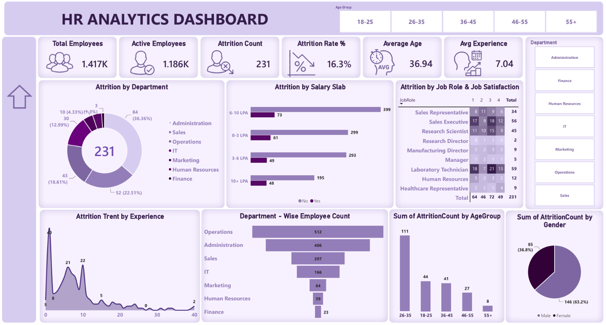

# HR Analytics Dashboard \| Power BI

An end-to-end HR data analysis project built with **Microsoft Power
BI**, **Power Query**, and **DAX** to analyze employee attrition and
workforce patterns through an interactive HR dashboard.

## Project Status
🚧 In Progress


## 📌 Problem Overview

Employee attrition can affect workforce stability, recruitment
requirements, and organizational planning. HR teams need a clear view of
**who is leaving, where attrition is concentrated, and which employee or
job-related factors are associated with attrition**.

This project analyzes an HR dataset to transform raw employee records
into an interactive dashboard that helps explore:


-   Overall employee attrition
-   Attrition across departments
-   Attrition by salary slab
-   Attrition across job roles and job satisfaction levels
-   Attrition trends by employee experience
-   Employee distribution across departments
-   Attrition by age group
-   Attrition by gender
-   Overall workforce and attrition KPIs

The goal of the project is to demonstrate a complete **data preparation
→ data modeling → DAX → visualization → dashboard development** workflow
in Power BI.

---

## 🎯 Project Objectives

The main objectives of this project are to:

1.  Prepare and clean the HR dataset for analysis.
2.  Remove duplicate and incomplete records where appropriate.
3.  Standardize inconsistent text values.
4.  Create calculated fields and DAX measures required for analysis.
5.  Calculate employee attrition metrics.
6.  Analyze attrition across different employee dimensions.
7.  Build an interactive and easy-to-read HR dashboard.
8.  Present HR metrics and patterns through business-focused
    visualizations.

---
## 📊 Dataset

-   **Dataset:** HR Employee Data
-   **Initial Rows:** 1,481
-   **Columns:** 37
-   **Final employee records represented in the dashboard:** 1,417

The dashboard uses the prepared dataset after the data-cleaning and
transformation steps.

> **Note:** The difference between the initial 1,481 rows and the 1,417
> employee records shown in the dashboard is a result of the
> data-preparation process.

---


## 🛠️ Tools & Technologies

-   **Microsoft Power BI**
-   **Power Query**
-   **DAX**
-   **Data Visualization**
-   **Data Cleaning & Transformation**

------------------------------------------------------------------------

## 🔄 Project Workflow

``` text
Raw HR Dataset
      ↓
Import Data into Power BI
      ↓
Data Inspection
      ↓
Data Cleaning with Power Query
      ↓
Handle Null Values
      ↓
Remove Duplicate Records
      ↓
Standardize Text Values
      ↓
Data Transformation
      ↓
Create Calculated Column & DAX Measures
      ↓
Build KPI Cards
      ↓
Create Interactive Visualizations
      ↓
Add Slicers & Filters
      ↓
Dashboard Design
      ↓
HR Analytics Dashboard
```
------------------------------------------------------------------------

## 🧹 Data Cleaning & Transformation

The following preparation steps were performed using **Power Query**:

-   Imported HR data into Power BI.
-   Inspected the dataset structure and fields.
-   Removed null values where appropriate.
-   Removed duplicate records.
-   Fixed inconsistent text values.
-   Transformed fields into suitable formats for analysis.
-   Prepared the cleaned data for visualization and DAX calculations.

---

## 🧮 DAX & Calculated Fields

DAX was used to create metrics required for the dashboard.

### Attrition Count

A calculated column was created to identify employee attrition:

``` dax
Attrition Count =
IF(
    'HR_Analytics-4'[Attrition] = "Yes",
    1,
    0
)
```

### Attrition Rate %

The dashboard uses an attrition-rate measure to calculate the percentage
of employees who left the organization:

``` dax
Attrition Rate % =
DIVIDE(
    SUM('HR_Analytics-4'[AttritionCount]),
    SUM('HR_Analytics-4'[EmployeeCount]),
    0
)

```
---
## 📈 Dashboard KPIs

The dashboard currently presents the following key metrics:

  KPI                  |       Value
  -------------------- |-----------
  Total Employees      |      1,417
  Active Employees     |      1,186
  Attrition Count      |        231
  Attrition Rate       |      16.3%
  Average Age          |      36.94
  Average Experience   | 7.04 years

These KPIs provide a high-level overview of the workforce and employee
attrition.

---

## 📊 Dashboard Analysis

The dashboard includes the following analysis areas:

### 1. Attrition by Department

Shows how the 231 attrition cases are distributed across departments
such as Administration, Sales, Operations, IT, Marketing, Human
Resources, and Finance.

### 2. Attrition by Salary Slab

Compares attrition counts across different salary ranges to identify how
employee exits are distributed by salary level.

### 3. Attrition by Job Role & Job Satisfaction

Examines attrition across job roles and job satisfaction scores to
provide a more detailed view of employee exits.

### 4. Attrition Trend by Experience

Visualizes attrition across years of employee experience to identify
where attrition cases are concentrated along the experience range.

### 5. Department-wise Employee Count

Shows the distribution of employees across departments and provides
context for comparing department-level attrition.

### 6. Attrition by Age Group

Breaks down attrition counts across age groups:

-   18--25
-   26--35
-   36--45
-   46--55
-   55+

### 7. Attrition by Gender

Shows the distribution of attrition cases by gender.

### 8. Interactive Filtering

The dashboard includes slicers for:

-   Age Group
-   Department

These allow users to explore the dashboard from different employee
segments.

---
## 💡 Key Dashboard Observations

Based on the current dashboard:

-   The prepared dataset contains **1,417 employees** represented in the
    dashboard.
-   **231 employees** are recorded as having left the organization.
-   The overall **attrition rate is 16.3%**.
-   The dashboard reports an **average employee age of 36.94 years**.
-   The reported **average experience is 7.04 years**.
-   Attrition is analyzed across multiple dimensions rather than being
    viewed only as an overall percentage.
-   The dashboard allows department and age-group filtering for more
    focused analysis.

These observations describe the dashboard results; they should not be
interpreted as evidence that a particular factor directly causes
attrition.

---

## 🎨 Dashboard Features

-   KPI cards for high-level HR metrics
-   Department-wise attrition donut chart
-   Salary-slab attrition comparison
-   Job role and job satisfaction matrix
-   Experience-based attrition trend
-   Department-wise employee count
-   Age-group attrition analysis
-   Gender-based attrition analysis
-   Interactive Age Group slicer
-   Interactive Department slicer
-   Consistent dashboard layout and visual hierarchy

---

## 🖼️ Dashboard Preview



---


## 📁 Suggested Repository Structure

``` text
HR-Analytics-PowerBI/
│
├── Data/
│   └── HR_Analytics_Data.csv
│
├── Asserts/
│   └── Dashboard.png
│   └── icons (All icons)
│
├── PowerBI/
│   └── HR Analytics Dashboard.pbix
│
├── README.md
└── .gitignore
```
---


## 🔍 Skills Demonstrated

This project demonstrates practical skills in:

-   Power BI
-   Power Query
-   DAX
-   Data Cleaning
-   Data Transformation
-   Data Modeling
-   KPI Development
-   Data Visualization
-   Dashboard Design
-   Interactive Reporting
-   HR Analytics
-   Business-focused Data Analysis

---

## 🚀 How to Use the Dashboard

1.  Download or clone this repository.
2.  Open the `.pbix` file in **Power BI Desktop**.
3.  Review the data model and Power Query transformations.
4.  Navigate to the dashboard page.
5.  Use the **Age Group** and **Department** slicers to interact with
    the report.
6.  Explore the visuals to analyze employee attrition patterns.
 ---

 ## 📚 What I Learned

Through this project, I practiced the complete Power BI analysis
workflow, including:

-   Preparing raw HR data for analysis
-   Using Power Query for data cleaning and transformation
-   Creating calculated columns and DAX measures
-   Designing KPI cards
-   Selecting appropriate visuals for different analytical questions
-   Building interactive slicers
-   Structuring a professional dashboard
-   Communicating analytical results through visual storytelling

---